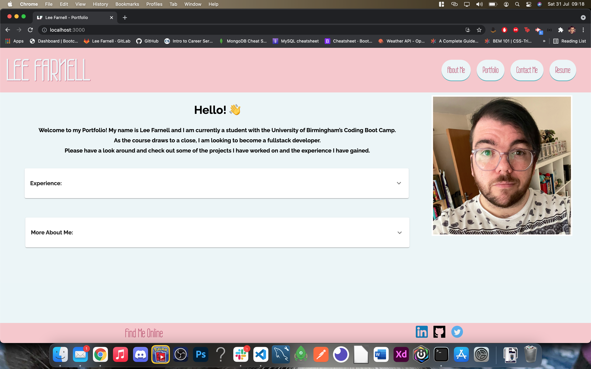
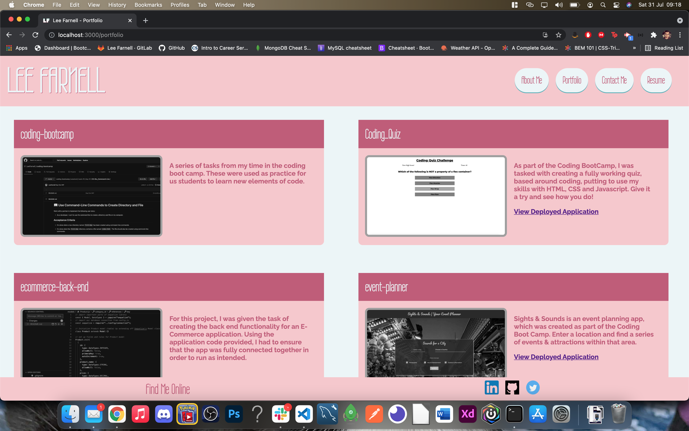
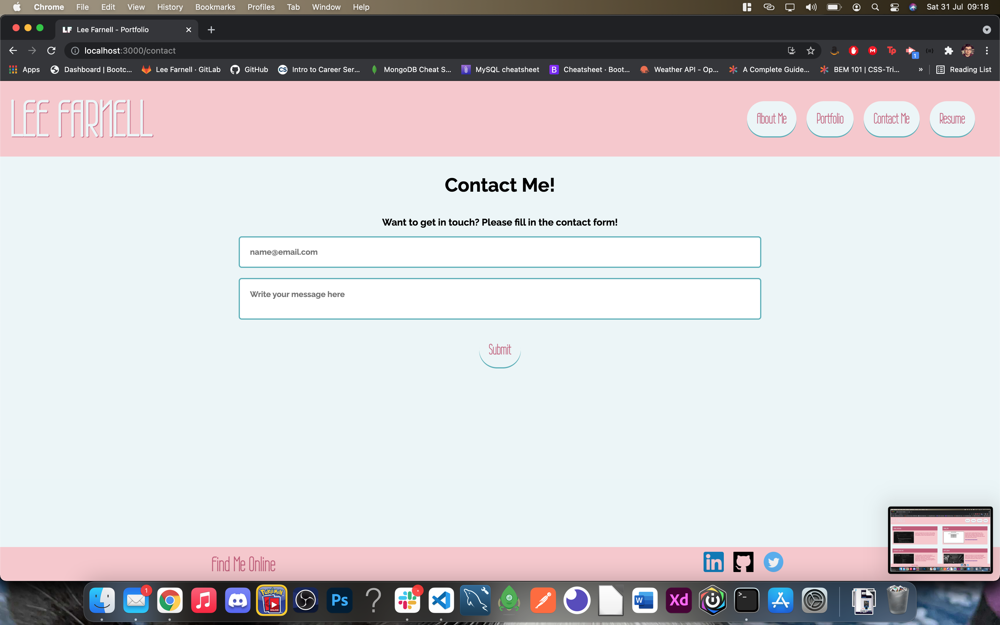
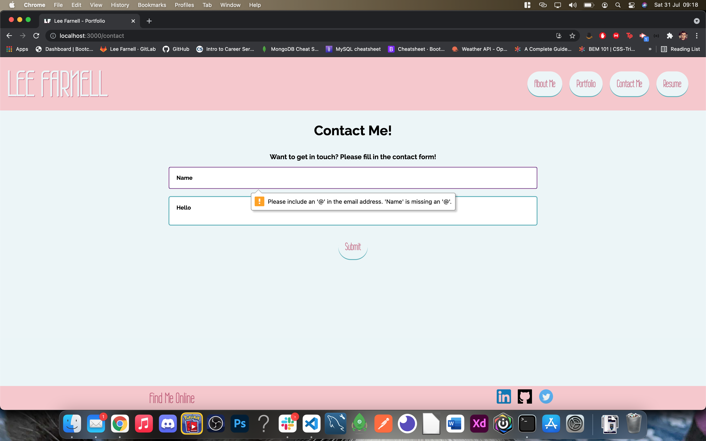

# React Portfolio


## Table of Contents

- [React Portfolio](#react-portfolio)
  - [Table of Contents](#table-of-contents)
  - [Description](#description)
  - [Installation](#installation)
  - [Usage](#usage)
  - [Licence](#licence)
  - [Deployed Link](#deployed-link)
  - [Tests](#tests)
  - [Screenshots](#screenshots)

## Description

Welcome to my portfolio, built using React. This app is a showcase of all the work I have created so far during my time at the University of Birmingham Coding Boot Camp.

Some of the technologies that I used to create this app are:

- React
- React Storybook
- Formspree
- HTML
- CSS
- Javascript

As part of the project, I had to ensure that the following criteria were met:

- My portfolio needed to have a header, navbar, footer and a project section
- I should have a contact page, which contained a contact form with validation.
- My projects section should contain at least 6 of my projects with pictures and links to both the github repo and the deployed application.
- There should be other ways to contact me including links to my social media platforms like LinkedIn
- There should be a way to download/view my resume.

## Installation

```
git clone git@github.com:LeeFarnell/react-portfolio.git

npm install

npm run start

```

## Usage

Click on the deployed link and away you go!

## Licence

This content is licenced under the MIT Licence.
https://www.mit.edu/~amini/LICENSE.md

## Deployed Link

https://leefarnell.github.io/react-portfolio/

## Tests

There are no tests required for this app.

## Screenshots





